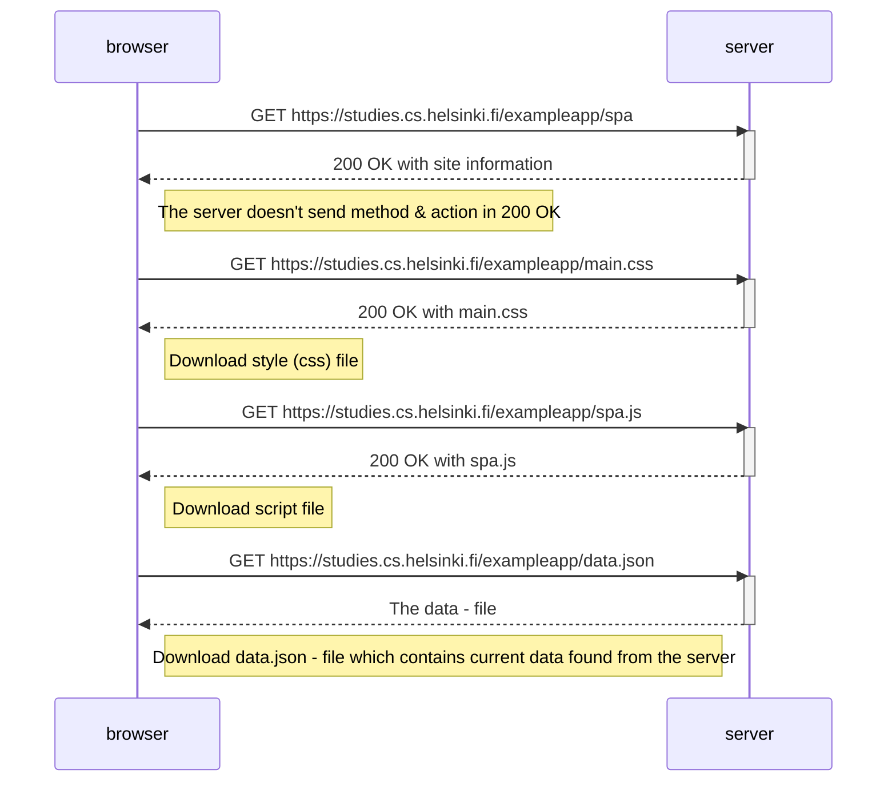

```mermaid
sequenceDiagram
    participant browser
    participant server

    browser->>server: GET https://studies.cs.helsinki.fi/exampleapp/spa
    activate server

    server-->>browser: 200 OK with site information
    deactivate server
	
    Note right of browser: The server doesn't send method & action in 200 OK

    browser->>server: GET https://studies.cs.helsinki.fi/exampleapp/main.css
    activate server

    server-->>browser: 200 OK with main.css
    deactivate server

	Note right of browser: Download style (css) file

    browser->>server: GET https://studies.cs.helsinki.fi/exampleapp/spa.js
    activate server

    server-->>browser: 200 OK with spa.js
    deactivate server

	Note right of browser: Download script file

    browser->>server: GET https://studies.cs.helsinki.fi/exampleapp/data.json
    activate server
    server-->>browser: The data - file
    deactivate server

    Note right of browser: Download data.json - file which contains current data found from the server
```
