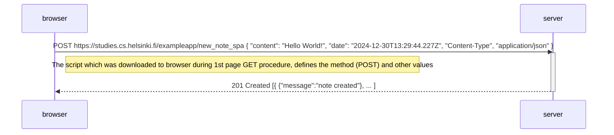

```mermaid
sequenceDiagram
    participant browser
    participant server

    browser->>server: POST https://studies.cs.helsinki.fi/exampleapp/new_note_spa { "content": "Hello World!", "date": "2024-12-30T13:29:44.227Z", "Content-Type", "application/json" }
    activate server

    Note right of browser: The script which was downloaded to browser during 1st page GET procedure, defines the method (POST) and other values

    server-->>browser: 201 Created [{ {"message":"note created"}, ... ]
    deactivate server
```
