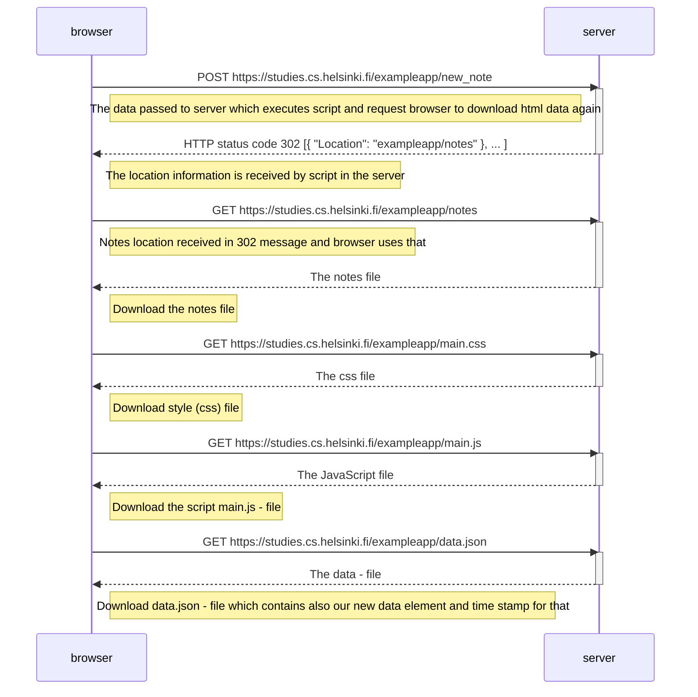

```mermaid
sequenceDiagram
    participant browser
    participant server

    browser->>server: POST https://studies.cs.helsinki.fi/exampleapp/new_note
    activate server

    Note right of browser: The data passed to server which executes script and request browser to download html data again

    server-->>browser: HTTP status code 302 [{ "Location": "exampleapp/notes" }, ... ]
    deactivate server

    Note right of browser: The location information is received by script in the server

    browser->>server: GET https://studies.cs.helsinki.fi/exampleapp/notes
    activate server

    Note right of browser: Notes location received in 302 message and browser uses that

    server-->>browser: The notes file
    deactivate server

    Note right of browser: Download the notes file

    browser->>server: GET https://studies.cs.helsinki.fi/exampleapp/main.css
    activate server
    server-->>browser: The css file
    deactivate server

    Note right of browser: Download style (css) file

    browser->>server: GET https://studies.cs.helsinki.fi/exampleapp/main.js
    activate server
    server-->>browser: The JavaScript file
    deactivate server

    Note right of browser: Download the script main.js - file

    browser->>server: GET https://studies.cs.helsinki.fi/exampleapp/data.json
    activate server
    server-->>browser: The data - file
    deactivate server

    Note right of browser: Download data.json - file which contains also our new data element and time stamp for that
```
